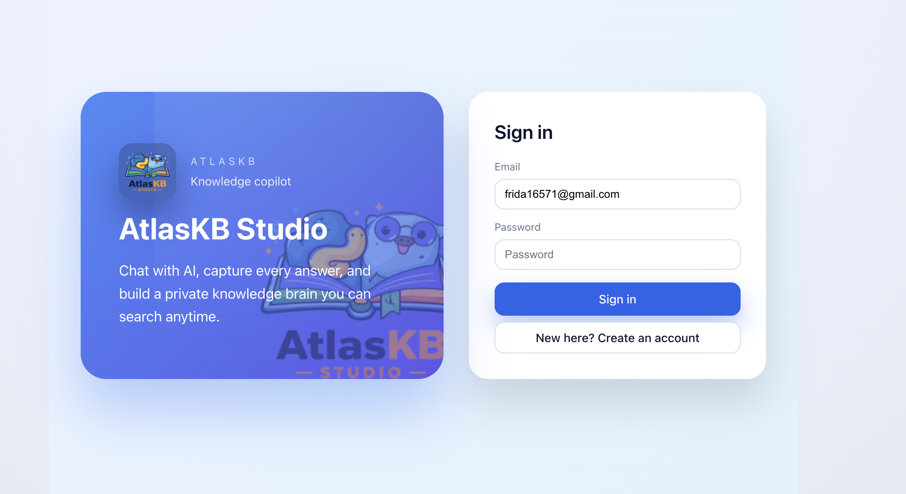
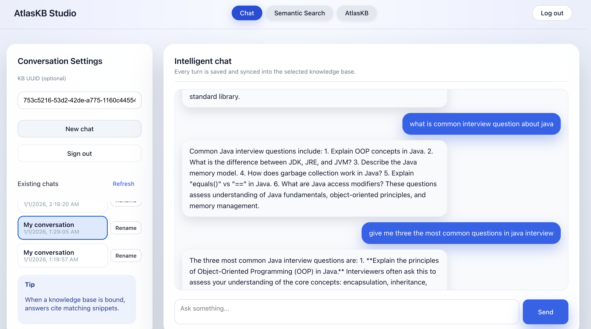
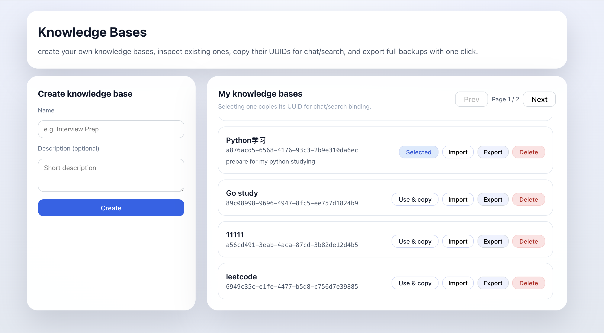

## AtlasKB 

AtlasKB is a full-stack knowledge management platform that lets teams ingest notes, search them in Elasticsearch, and chat with an OpenAI-powered assistant that cites the knowledge base.

The repository contains both the **FastAPI backend** (auth, KB CRUD, chat/QA workflows, OpenAI + Elasticsearch integration) and the **Vite + React frontend** (login, chat console, keyword search, KB manager).

---

## Feature Overview

| Area | Capabilities |
| ---- | ------------ |
| Knowledge bases | Create/list/delete, copy UUIDs for binding, export Zip bundles (docs + embeddings) for backup or migration. |
| Document ingestion | Upload markdown/txt, CSV, DOCX, PPTX, or PDF files to auto-create KB docs (embeddings generated on import). |
| Document store | Chat/QA turns automatically become `Q:` / `A:` documents, chunked and embedded into ES (`kb_index`, `kb_doc_index`, `kb_doc_embed_index`). |
| Chat workspace | Multi-turn chat with KB binding, rename chats, clear conversation, view referenced snippets, switch between chats. |
| QA API | retrieves vector-similar chunks and asks OpenAI for an answer, writing results back to the KB. |
| Keyword search | Dedicated UI + API using ES `multi_match` with highlighting—no OpenAI call, perfect for deterministic audits. |
| Auth | JWT login/registration, email-or-username login, bcrypt hashing, precise error handling. |

---

## Architecture

```
React + Vite UI  ──────►  FastAPI backend
                         │
                         ├─ OpenAI API (chat + embeddings)
                         └─ Elasticsearch (kb_index, kb_doc_index, kb_doc_embed_index)
```

- Chat/QA: embed question → fetch top KB chunks via ES dense vectors → append to OpenAI prompt → save answer + embedding.
- Keyword search: call `/fulltext-search`, which runs ES `multi_match` + highlighting, returning scored snippets (no OpenAI dependency).
- Export: backend bundles `kb.json`, `docs.json`, `embeddings.json` in Zip; frontend downloads via the Knowledge Bases tab.

---

## Getting Started

### Prerequisites

- Python 3.10+
- Node.js 18+
- Docker Desktop (for Elasticsearch)
- OpenAI API key

### Backend

```bash
cd knowledge-base
python -m venv .venv
source .venv/bin/activate        # Windows: .venv\Scripts\activate
pip install -r requirements.txt
cp .env.example .env             # set OPENAI_API_KEY, JWT_SECRET, ES URL

cd deploy
docker-compose up -d             # starts Elasticsearch + Kibana
cd ..

python main.py                   # http://127.0.0.1:8000
```

Swagger UI: `http://127.0.0.1:8000/swagger-ui`

### Frontend

```bash
cd frontend
npm install
cp .env.example .env             # configure VITE_API_BASE if needed
npm run dev                      # http://127.0.0.1:5173
```
---

## Demo

| Login & Tabs | Chat Workspace |
| --- | --- |
|  |  |

| Keyword Search | Knowledge Bases |
| --- | --- |
|  |  |

---


Enjoy shipping with AtlasKB! Contributions and ideas are always welcome.
